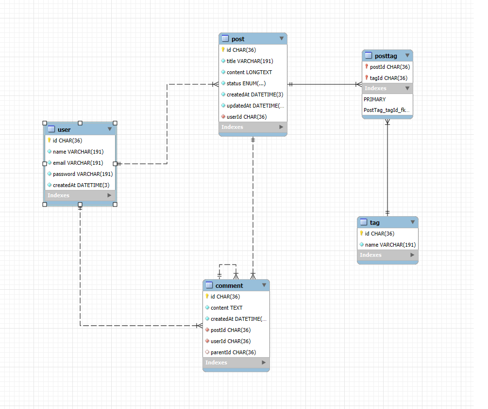

# Database Design - DevShare Lite

## Tổng quan cơ sở dữ liệu

**DevShare Lite** sử dụng cơ sở dữ liệu quan hệ **MySQL** để lưu trữ thông tin về người dùng, bài viết, bình luận, và các thẻ (tags) liên quan. **MySQL** được chọn vì nó là một hệ quản trị cơ sở dữ liệu quan hệ mạnh mẽ, có khả năng xử lý các quan hệ dữ liệu phức tạp và hỗ trợ các tính năng như truy vấn hiệu quả, đảm bảo tính toàn vẹn dữ liệu, và dễ dàng bảo trì.

Cơ sở dữ liệu này bao gồm các bảng chính sau:

- **users**: Chứa thông tin người dùng.
- **posts**: Chứa thông tin bài viết.
- **comments**: Chứa thông tin bình luận về bài viết.
- **tags**: Chứa thông tin các thẻ.
- **post_tags**: Bảng phụ để quản lý mối quan hệ giữa bài viết và thẻ.

## Sơ đồ quan hệ thực thể (ERD)

## Chi tiết các bảng và trường dữ liệu

### 1. Bảng `User`

Bảng `User` lưu trữ thông tin người dùng, bao gồm các trường như tên, email và mật khẩu. Dữ liệu về thời gian tạo tài khoản cũng được lưu lại.

| Trường        | Kiểu dữ liệu               | Mô tả                                    |
|---------------|----------------------------|------------------------------------------|
| `id`          | `CHAR(36)`                 | ID người dùng (Khóa chính)               |
| `name`        | `VARCHAR(191)`             | Tên người dùng                           |
| `email`       | `VARCHAR(191)`             | Địa chỉ email của người dùng (Đảm bảo duy nhất)|
| `password`    | `VARCHAR(191)`             | Mật khẩu của người dùng (đã mã hóa)      |
| `createdAt`   | `DATETIME(3)`              | Thời gian tạo tài khoản                  |

- **Khóa chính**: `id` là khóa chính.
- **Khóa duy nhất**: `email` phải duy nhất.
- **Khóa ngoại**: Không có khóa ngoại trong bảng này.

### 2. Bảng `Post`

Bảng `Post` lưu trữ thông tin về các bài viết, bao gồm tiêu đề, nội dung, trạng thái và người dùng đã tạo bài viết.

| Trường        | Kiểu dữ liệu               | Mô tả                                    |
|---------------|----------------------------|------------------------------------------|
| `id`          | `CHAR(36)`                 | ID bài viết (Khóa chính)                |
| `title`       | `VARCHAR(191)`             | Tiêu đề bài viết                        |
| `content`     | `LONGTEXT`                 | Nội dung bài viết                       |
| `status`      | `ENUM('Draft', 'Published')`| Trạng thái bài viết (Draft hoặc Published)|
| `createdAt`   | `DATETIME(3)`              | Thời gian tạo bài viết                  |
| `updatedAt`   | `DATETIME(3)`              | Thời gian cập nhật bài viết             |
| `userId`      | `CHAR(36)`                 | ID người dùng tạo bài viết (Khóa ngoại từ bảng `User`)|

- **Khóa chính**: `id` là khóa chính.
- **Khóa ngoại**: `userId` liên kết với `id` trong bảng `User`.

### 3. Bảng `Comment`

Bảng `Comment` lưu trữ các bình luận người dùng tạo đối với bài viết. Bình luận có thể có phản hồi, và mỗi bình luận liên kết với một bài viết và người dùng.

| Trường        | Kiểu dữ liệu               | Mô tả                                    |
|---------------|----------------------------|------------------------------------------|
| `id`          | `CHAR(36)`                 | ID bình luận (Khóa chính)               |
| `content`     | `TEXT`                      | Nội dung bình luận                       |
| `createdAt`   | `DATETIME(3)`              | Thời gian tạo bình luận                  |
| `postId`      | `CHAR(36)`                 | ID bài viết mà bình luận thuộc về       |
| `userId`      | `CHAR(36)`                 | ID người dùng bình luận                  |
| `parentId`    | `CHAR(36)`                 | ID bình luận cha (nếu là phản hồi, có thể NULL) |

- **Khóa chính**: `id` là khóa chính.
- **Khóa ngoại**:
  - `postId` liên kết với `id` trong bảng `Post`.
  - `userId` liên kết với `id` trong bảng `User`.
  - `parentId` liên kết với `id` trong bảng `Comment` (để tạo mối quan hệ phản hồi).

### 4. Bảng `Tag`

Bảng `Tag` lưu trữ thông tin về các thẻ (tags) mà người dùng có thể gắn vào bài viết, giúp phân loại các bài viết.

| Trường        | Kiểu dữ liệu               | Mô tả                                    |
|---------------|----------------------------|------------------------------------------|
| `id`          | `CHAR(36)`                 | ID thẻ (Khóa chính)                     |
| `name`        | `VARCHAR(191)`             | Tên thẻ (Ví dụ: "JavaScript", "Node.js")|

- **Khóa chính**: `id` là khóa chính.
- **Khóa duy nhất**: `name` phải duy nhất.

### 5. Bảng `PostTag`

Bảng `PostTag` là bảng phụ để quản lý mối quan hệ nhiều-một giữa bài viết và thẻ (tags). Mỗi bài viết có thể có nhiều thẻ, và mỗi thẻ có thể thuộc nhiều bài viết.

| Trường        | Kiểu dữ liệu               | Mô tả                                    |
|---------------|----------------------------|------------------------------------------|
| `postId`      | `CHAR(36)`                 | ID bài viết (Khóa ngoại từ bảng `Post`) |
| `tagId`       | `CHAR(36)`                 | ID thẻ (Khóa ngoại từ bảng `Tag`)      |

- **Khóa chính**: `postId` và `tagId` kết hợp làm khóa chính.
- **Khóa ngoại**:
  - `postId` liên kết với `id` trong bảng `Post`.
  - `tagId` liên kết với `id` trong bảng `Tag`.

## Lý do lựa chọn MySQL

**MySQL** được chọn vì các lý do sau:

- **Tính ổn định và hiệu suất cao**: MySQL là hệ quản trị cơ sở dữ liệu quan hệ nổi bật, đã được tối ưu hóa cho hiệu suất và sử dụng rộng rãi trong các ứng dụng web.
- **Hỗ trợ mối quan hệ dữ liệu phức tạp**: Với khả năng quản lý các bảng có mối quan hệ nhiều-một, MySQL rất phù hợp cho ứng dụng như DevShare Lite, nơi có các quan hệ giữa bài viết, người dùng, bình luận và thẻ.
- **Tính linh hoạt và mở rộng dễ dàng**: MySQL hỗ trợ các tính năng như chỉ mục, khóa ngoại và các loại dữ liệu phức tạp, giúp đảm bảo hiệu suất và bảo mật cao cho các hệ thống lớn.
- **Tính phổ biến**: MySQL là một trong những hệ quản trị cơ sở dữ liệu phổ biến nhất, dễ dàng kết hợp với các công cụ và dịch vụ hỗ trợ, giúp phát triển và bảo trì hệ thống dễ dàng hơn.

